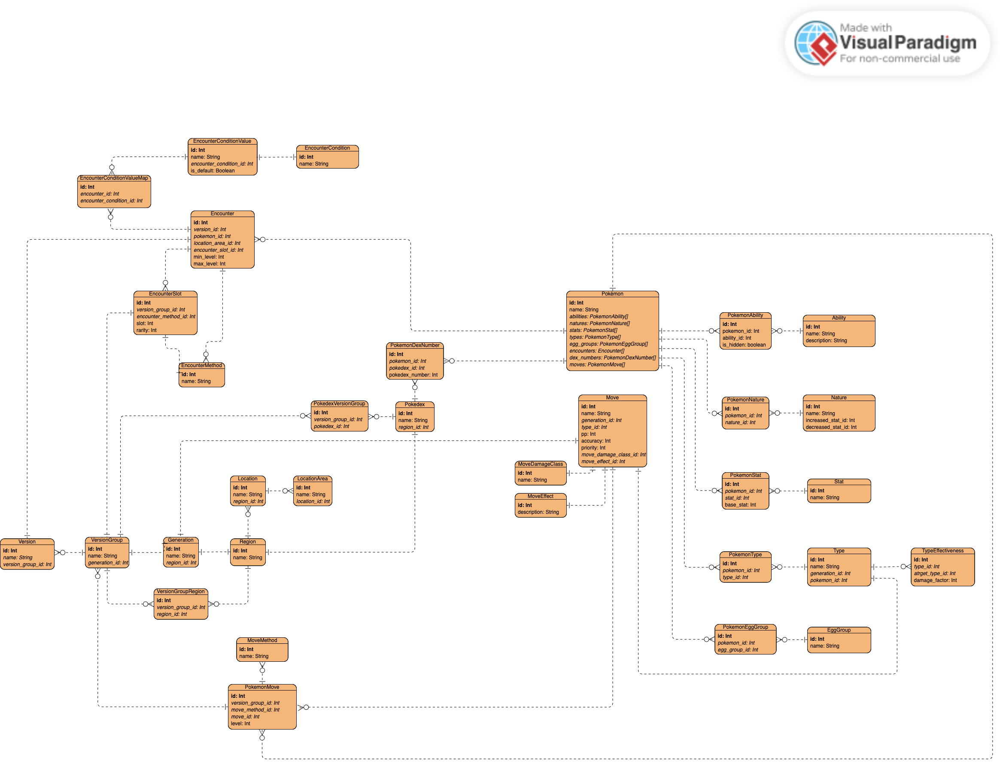

# **PKMNHub**
*A Pokémon gameplay companion platform*

PKMNHub is a personal full-stack development project built to deepen experience with scalable backend design, AI workflow integration, and TypeScript ecosystem. This in-progress full-stack application is designed to centralize useful tools for Pokémon players including team building, breeding calculator, Pokéwalker step tracking, and Pokédex management. The platform uses a AI-powered insights to support personalized decision-making.

---

## 🎯 Purpose
PKMNHub is a **personal learning project** aimed at exploring scalable full-stack architecture and AI-driven application workflows using modern TypeScript tools. It is under active development and continues to evolve as new concepts are implemented.

---

## 🚧 **Project Status**
This project is currently **under active development**. Core backend API, authentication, and AI agent (partly) are implemented, with full UI and full features being built iteratively.

---

## 🧠 **Key Features (Planned / In Progress)**

| Feature | Status |
|--------|--------|
| User authentication via JWT | 🟢 Completed |
| Protected API routes using middleware | 🟢 Completed |
| Pokémon database design with normalized relational schema | 🟡 In Progress |
| AI Agent for team suggestions | 🟡 In Progress |
| Pokémon Team Builder | 🔜 Planned |
| Breeding Calculator | 🔜 Planned |
| Pokéwalker Step Tracker | 🔜 Planned |
| Pokédex Management | 🔜 Planned |
| React Query-powered client requests | 🟡 In Progress |
| API testing (Postman) | 🟡 In Progress |
| E2E testing (Playwright) | 🔜 Planned |
| Clean minimal UI using Next.js frontend | 🟡 In Progress |

---

## 🏗 **Software Design & Architecture**

### **Backend**
- Next.js App Router for server-side API routing
- Prisma ORM + PostgreSQL for relational data modeling and querying
- Service layer using OOP Delegate pattern
- Middleware authentication with JWT + bcrypt hashing
- Controllers for clean separation of concerns
- LangChain + LangGraph + Groq for AI workflow execution

### **Frontend**
- Next.js + React
- React Query for data fetching & caching
- Client-side hooks for API interaction

### **Database**
- PostgreSQL with normalized schema for many-to-many relationships
- Dataset imported from CSV and transformed for complete local control from: https://github.com/PokeAPI/pokeapi/tree/master
- Entity Relationship Model (version 19-11-25):

---

## 🧪 **Testing**
| Tool | Purpose |
|-------|----------|
| Postman | API validation and collection testing |
| Playwright | UI and E2E test automation |

---

## 💡 **Planned AI Capabilities**
- Team-building recommendations based on each game
- Type & move coverage analysis
- Breeding optimization suggestions
- Natural-language Pokémon knowledge search

---

## 📦 **Tech Stack**
**TypeScript, Next.js, React, Node.js, PostgreSQL, Prisma, JWT, React Query, Groq, LangChain, LangGraph, Playwright, Postman**

---

## 🚀 **Development Setup**
Installation & environment configuration instructions will be added after backend + initial frontend deployment.

---

## 📍 Roadmap (16 November 2025 onwards)
- [ ] Complete Pokémon DB schema relationships & import data
- [ ] Build Pokédex management system
- [ ] Implement Team Builder
- [ ] Develop Breeding Calculator
- [ ] Add pokewalker tracker 
- [ ] Integrate specialized AI advisor & agents workflow orchestration
- [ ] Add User saved data
- [ ] (Possible Addition) Deploy

---

